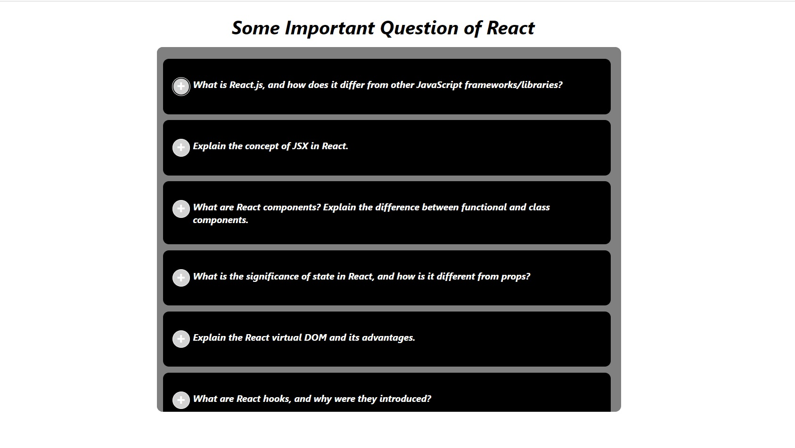

# Accordion 
- In our React application, we've implemented a sleek and interactive accordion component using React for dynamic content display. The accordion is styled using CSS to ensure a clean and visually appealing design.

## Key features:
  1. Positioning and Styling:
     - The accordion is positioned absolutely on the page, ensuring it stands out in the user interface.
     - The background color is set to a subtle grey, creating a modern and elegant look.
     - It has a width of 600px, with 10px padding and a border-radius of 10px for rounded corners.
  2. Scrollable Content:
     - The accordion is designed to contain a substantial amount of content, with a fixed height of 600px.
     - The overflow: auto property allows users to scroll through the content if it exceeds the visible area.
  3. Scrollable Customization:
     - While the scrollbar is present for practicality, its appearance has been customized to ensure a seamless design.
     - The scrollbar is kept thin, and its color is set to transparent, making it blend with the overall accordion style.
  4. Responsive Positioning:
     - The accordion is intelligently positioned at 10% from the top and centered horizontally between 25% and 75% of the page width. This ensures responsiveness across different screen sizes.

### React Integration and CSS Styling:
  - React components are used to create a modular structure, enhancing code readability and maintainability.
  - The use of state and props allows for dynamic content updates, making the accordion versatile for various use cases.
  - Within the React component, the font is styled with an italic emphasis (font-style: italic;) to provide a distinct visual style.

# Website Images:
  1. App in Large Screen
  
